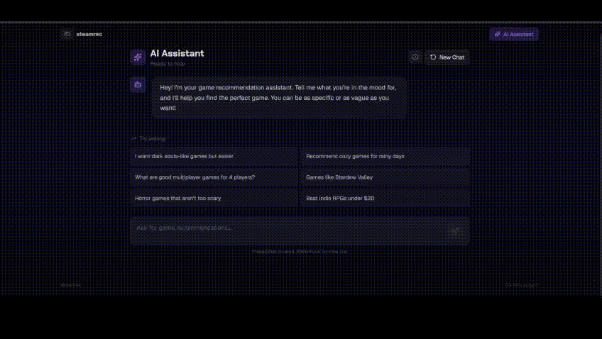

# Steamrec - Frontend



A modern, performant Next.js frontend for discovering and exploring Steam games. Built with React 19, Next.js 16, and Tailwind CSS 4, featuring advanced search, AI-powered recommendations, and a beautiful, responsive UI.

## Features

### 🎮 Game Discovery

- **Smart Search**: Real-time hybrid search with text and visual similarity powered by BM25 + CLIP
- **Advanced Filtering**: Filter by genre, platform (Windows/Mac/Linux), and price range
- **Trending Games**: Discover popular titles based on community metrics
- **Similar Games**: Find games similar to any title using vector similarity
- **Detailed Game Pages**: Rich game information with screenshots, metadata, ratings, and reviews

### 🤖 AI Chat Assistant

- **Conversational Search**: Natural language game recommendations powered by RAG (Retrieval-Augmented Generation)
- **Real-Time Streaming**: Token-by-token response streaming with Server-Sent Events (SSE)
- **Multi-Turn Conversations**: Persistent sessions with conversation history
- **Smart Citations**: Clickable game references linked to detail pages
- **Multi-Modal Input**: Text + image support for visual game searches
- **Suggested Prompts**: Pre-built example queries for quick discovery

### 🎨 Modern UI/UX

- **Responsive Design**: Mobile-first approach with breakpoints for all screen sizes
- **Dark Theme**: Beautiful gradient-based dark mode with purple/blue accents
- **Smooth Animations**: Framer Motion powered transitions and interactions
- **Image Optimization**: Next.js Image component with automatic optimization
- **Loading States**: Skeleton loaders and streaming indicators for seamless UX
- **Error Handling**: Graceful error states with user-friendly messages

## Tech Stack

- **Framework**: Next.js 16.2 (App Router)
- **React**: React 19.2 with Server Components
- **TypeScript**: Fully typed for type safety
- **Styling**: Tailwind CSS 4 with custom configuration
- **UI Components**: 
  - shadcn/ui components
  - Radix UI primitives
  - Lucide React icons
- **Animations**: Framer Motion 12
- **Carousel**: Embla Carousel for screenshot galleries
- **State Management**: React hooks (useState, useEffect, useCallback)
- **Package Manager**: pnpm 10.33+

## Installation

### Prerequisites

- Node.js 20+ (LTS recommended)
- pnpm 10.33+ (or npm/yarn)
- Backend API running on `http://localhost:8000` (or configured via `NEXT_PUBLIC_API_URL`)

### Setup

1. **Install dependencies**:
```bash
pnpm install
```

2. **Configure environment variables**:
Create a `.env.local` file in the frontend directory:
```env
# Backend API URL
NEXT_PUBLIC_API_URL=http://localhost:8000

# Optional: Analytics, error tracking, etc.
# NEXT_PUBLIC_GA_ID=your_google_analytics_id
```

3. **Start development server**:
```bash
pnpm dev
```

The app will be available at `http://localhost:3000`.

4. **Build for production**:
```bash
pnpm build
pnpm start
```

## Project Structure

```
frontend/
├── src/
│   ├── app/                      # Next.js App Router pages
│   │   ├── layout.tsx           # Root layout with metadata
│   │   ├── page.tsx             # Home page (trending + search)
│   │   ├── search/
│   │   │   └── page.tsx         # Search results page
│   │   ├── chat/
│   │   │   └── page.tsx         # AI chat assistant page
│   │   └── game/
│   │       └── [id]/
│   │           └── page.tsx     # Game detail page (dynamic)
│   ├── components/               # React components
│   │   ├── SearchBar.tsx        # Search input component
│   │   ├── GameCard.tsx         # Game preview card
│   │   ├── GameGrid.tsx         # Responsive game grid
│   │   ├── ChatInput.tsx        # Chat message input
│   │   ├── ChatMessage.tsx      # Chat message bubble
│   │   ├── ScreenshotGallery.tsx # Image carousel
│   │   ├── Header.tsx           # Site header/navigation
│   │   ├── Footer.tsx           # Site footer
│   │   └── ui/                  # shadcn/ui components
│   │       ├── button.tsx
│   │       ├── card.tsx
│   │       ├── badge.tsx
│   │       ├── input.tsx
│   │       ├── skeleton.tsx
│   │       ├── carousel.tsx
│   │       ├── scroll-area.tsx
│   │       └── separator.tsx
│   ├── hooks/                    # Custom React hooks
│   │   └── useChatStream.ts     # SSE streaming hook
│   ├── lib/                      # Utilities and API
│   │   ├── api.ts               # Backend API client
│   │   ├── types.ts             # TypeScript type definitions
│   │   └── utils.ts             # Helper functions (cn, etc.)
│   └── styles/
│       └── globals.css          # Global styles and Tailwind
├── public/                       # Static assets
├── package.json                  # Dependencies and scripts
├── tsconfig.json                # TypeScript configuration
├── tailwind.config.ts           # Tailwind CSS configuration
├── next.config.js               # Next.js configuration
└── README.md                    # This file
```

## Key Features Implementation

### 1. Hybrid Search

The search page combines text and image-based search with advanced filtering:

```typescript
// Example: Search with filters
const results = await searchGames("roguelike", 20, {
  genre: "Action",
  platform: "Windows",
  price_min: 0,
  price_max: 30
});
```

**Features**:
- Real-time search results
- Genre, platform, and price filters
- Debounced input to optimize API calls
- Loading skeletons for smooth UX

### 2. AI Chat Assistant

Conversational game recommendations with streaming responses:

```typescript
// Example: Send chat message with streaming
const { response, isStreaming } = useChatStream();
await sendMessage("I want dark souls-like games but easier");
```

**Features**:
- Server-Sent Events (SSE) for real-time streaming
- Multi-turn conversations with session management
- Smart game citations: `[Game Name](game_id)` → clickable links
- Image upload support for visual searches
- Suggested prompts for quick discovery

### 3. Game Detail Pages

Rich game information with metadata and screenshots:

**Features**:
- Dynamic routing: `/game/[id]`
- Full game metadata (price, rating, release date, developer)
- Screenshot carousel with Embla
- Similar games recommendations
- Optimized images with Next.js Image

### 4. Responsive Design

Mobile-first approach with Tailwind breakpoints:

```typescript
// Example: Responsive grid
<div className="grid grid-cols-1 sm:grid-cols-2 lg:grid-cols-3 xl:grid-cols-4 gap-5">
  {games.map(game => <GameCard key={game.id} game={game} />)}
</div>
```

**Breakpoints**:
- `sm`: 640px (tablets)
- `md`: 768px (small laptops)
- `lg`: 1024px (laptops)
- `xl`: 1280px (desktops)
- `2xl`: 1536px (large screens)

## Custom Hooks

### `useChatStream`

Manages SSE streaming for chat responses:

```typescript
const {
  response,           // Current streamed response
  isStreaming,        // Streaming status
  error,              // Error message
  sessionId,          // Current session ID
  gamesRetrieved,     // Number of games retrieved
  sendMessage,        // Send chat message
  clearSession,       // Clear conversation
  resetResponse,      // Reset response state
} = useChatStream();
```

**Features**:
- Automatic session management
- FormData support for image uploads
- SSE parsing and event handling
- Error recovery and cleanup

## API Integration

All backend communication is centralized in `src/lib/api.ts`:

```typescript
// Search games
searchGames(query, limit, filters)

// Get game by ID
getGame(id)

// Get similar games
getSimilarGames(id, limit, rerank)

// Get trending games
getTrending(limit)

// Send chat message (non-streaming)
sendChatMessage(query, sessionId, filters)

// Clear chat session
clearChatSession(sessionId)
```

**Configuration**:
- API base URL: `NEXT_PUBLIC_API_URL` env variable
- Default: `http://localhost:8000`

## Styling

### Tailwind Configuration

Custom Tailwind setup in `tailwind.config.ts`:

```typescript
// Custom colors
colors: {
  background: '#0a0a0f',
  foreground: '#f8f8ff',
  purple: { /* custom shades */ },
  // ... more colors
}

// Custom fonts
fontFamily: {
  heading: ['var(--font-geist-sans)'],
  body: ['var(--font-geist-sans)'],
}
```

### Global Styles

Custom CSS in `src/styles/globals.css`:

```css
/* Gradient text effect */
.text-gradient {
  background: linear-gradient(135deg, #a78bfa 0%, #60a5fa 100%);
  -webkit-background-clip: text;
  -webkit-text-fill-color: transparent;
}

/* Glow effects */
.bg-glow { /* radial gradient background */ }
.text-glow { /* text shadow glow */ }
```

## Component Library

### shadcn/ui Components

Pre-built, customizable components:

- **Button**: Multiple variants (default, ghost, outline)
- **Card**: Container with border and background
- **Badge**: Pills for tags and labels
- **Input**: Styled form inputs
- **Skeleton**: Loading placeholders
- **Carousel**: Image slider with Embla
- **ScrollArea**: Custom scrollbar styling
- **Separator**: Visual dividers

**Example Usage**:
```tsx
import { Button } from "@/components/ui/button";

<Button variant="ghost" size="sm">
  Click me
</Button>
```

## Performance Optimizations

### 1. Image Optimization

```tsx
<Image
  src={game.header_image}
  alt={game.name}
  fill
  sizes="(max-width: 640px) 100vw, (max-width: 1024px) 50vw, 25vw"
  className="object-cover"
/>
```

**Benefits**:
- Automatic format selection (WebP/AVIF)
- Responsive image sizes
- Lazy loading by default
- Blur placeholders

### 2. Code Splitting

Next.js automatically splits code by route:
- Each page gets its own bundle
- Shared components are extracted
- Dynamic imports for large components

### 3. Client/Server Components

```tsx
// Server Component (default)
export default async function Page() {
  const data = await fetch(...);
  return <div>{data}</div>;
}

// Client Component (interactive)
"use client";
export default function Interactive() {
  const [state, setState] = useState();
  return <button onClick={...}>Click</button>;
}
```

## Development

### Running in Development

```bash
pnpm dev
```

**Features**:
- Fast Refresh for instant updates
- TypeScript type checking
- ESLint for code quality

### Building for Production

```bash
pnpm build
pnpm start
```

**Optimizations**:
- Minified JavaScript bundles
- Optimized CSS
- Static page pre-rendering
- Image optimization

### Linting

```bash
pnpm lint
```

## Deployment

### Vercel (Recommended)

1. Push code to GitHub
2. Import project in Vercel
3. Set environment variables:
   - `NEXT_PUBLIC_API_URL`
4. Deploy

### Docker

```dockerfile
FROM node:20-alpine
WORKDIR /app
COPY package*.json ./
RUN npm install
COPY . .
RUN npm run build
EXPOSE 3000
CMD ["npm", "start"]
```

### Static Export (Optional)

For static hosting (no server features):

```bash
pnpm build
# Output in: out/
```

## Environment Variables

| Variable              | Description          | Default                 | Required |
| --------------------- | -------------------- | ----------------------- | -------- |
| `NEXT_PUBLIC_API_URL` | Backend API base URL | `http://localhost:8000` | No       |

## Browser Support

- **Chrome/Edge**: Latest 2 versions
- **Firefox**: Latest 2 versions
- **Safari**: Latest 2 versions
- **Mobile**: iOS Safari 12+, Chrome Android latest

## Accessibility

- Semantic HTML elements
- ARIA labels where needed
- Keyboard navigation support
- Focus indicators
- Alt text for images

## Contributing

### Code Style

- Use TypeScript for type safety
- Follow ESLint configuration
- Use Prettier for formatting
- Write descriptive component names
- Keep components small and focused

### Component Guidelines

1. **Single Responsibility**: One component, one purpose
2. **Props Typing**: Always type props with TypeScript
3. **Error Boundaries**: Handle errors gracefully
4. **Loading States**: Always show loading indicators
5. **Accessibility**: Use semantic HTML and ARIA

## Known Issues

- Image loading may fail for some Steam games (fallback icon shown)
- SSE streaming may not work behind certain proxies (fallback to non-streaming mode)

## Future Enhancements

- [ ] User authentication and saved favorites
- [ ] Game collections and lists
- [ ] Advanced search with more filters (tags, release year, etc.)
- [ ] Dark/light theme toggle
- [ ] Offline support with service workers
- [ ] Progressive Web App (PWA) support
- [ ] Social sharing features
- [ ] Game comparison tool

## Support

For issues, questions, or contributions, please refer to the main project repository.

---

**Built with Next.js 16, React 19, Tailwind CSS 4, and shadcn/ui**
